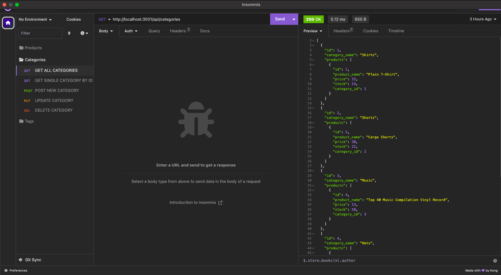

# Ecommerce Back End

## Description

A back end ecommerce application using sequelize and express.

* Walkthrough video: https://drive.google.com/file/d/1EnhYWAXYbDl-GoXPWu8WTc9iW6E0hIN9/view

## Installation

Must have node.js installed.

## Usage

In your terminal, "npm run seed" to seed data into the database. Then, enter "npm start" to start the server. The project was tested by using Insomnia. You can opt to use it as well or the browser.

## Contributing

Contributions are welcome

## Contact-Me

You can contact me through my Github account and email:

- GitHub username: [MrPolkadot](github.com/MrPolkadot)
- Email: ceballos93@gmail.com
